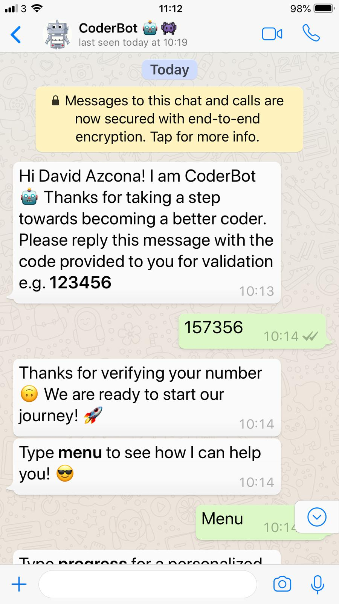
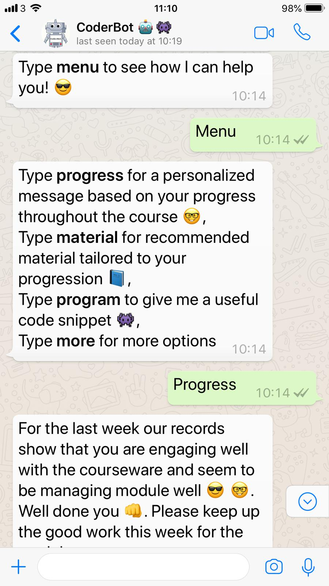
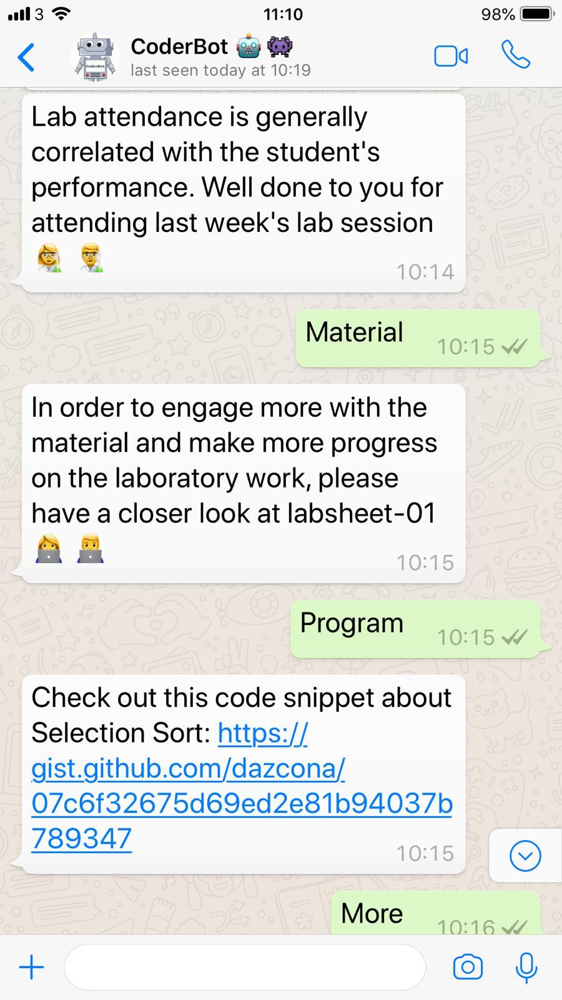

# CoderBot: Code Assistant

Code Assistant is a Whatsapp Artificial Intelligence ChatBot to support learning of computer programming for college students 🤖 👾 

## Desc

Conventionally, learning analytics are used to notify students regarding their predicted performance and further resources using email or via a university's Learning Management System. To support students to engage in learning and become more pro-active about their learning, we designed CoderBot. CoderBot, is an Artificial Intelligent Chatbot service deployed on WhatsApp1 as a coding assistant to support learning of computer programming. CoderBot has been deployed in our University’s Python Programming I course.

* You can interact with the assistant and find out how your are progressing on the module, recommended material and short snippets of code.
* Your phone number will be completely **deleted** from our system at the end of the semester.
* You can **opt-out** at anytime.

---

## Demo

---

## Technologies

* Python 3
* [MongoDB](https://www.mongodb.com/)
* [Flask](http://flask.pocoo.org/)
* [Bootstrap](https://getbootstrap.com/)
* [Docker](https://www.docker.com/)
* [WhatsApp Wrapper API](https://github.com/mukulhase/WebWhatsapp-Wrapper)
* [Selenium](https://www.seleniumhq.org/)
* Github & [gists](https://gist.github.com/dazcona)
* [Google's Phone Validator](https://pypi.org/project/phonenumbers/)

---

## Screenshots

 
 

